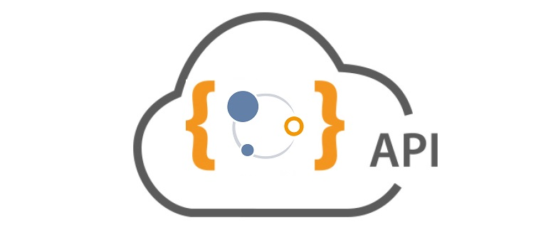

# API REST d'Isogeo

# Documentation pour les développeurs tiers

La plateforme Isogeo est une suite logicielle dédiée à l'inventaire, l'indexation et à la valorisation des données géographiques. Afin de favoriser le développement des usages, elle met à disposition son API REST dont les caractéristiques techniques et les possibilités fonctionnelles sont décrites dans cette documentation.

## Principales caractéristiques

* l’API ne concerne pour l’instant que l’accès **en lecture** des informations d’Isogeo ;
* l'API nécessite une authentification basée sur le protocole oAuth2 ;
* l'API est susceptible d'être modifiée ;
* la plupart des actions disponibles sur [https://app.isogeo.com](https://app.isogeo.com) sont disponibles dans l’API \(sauf le SCAN et fonctionnalités particulières\) ;
* la documentation s’appuie sur les éléments de vocabulaire liés au secteur de l’information géographique généralement et plus spécifiquement à la plateforme Isogeo.

## En action

Certains applicatifs permettent de voir l’API en action :

* la principale application de la plateforme, l'interface d'administration [APP](https://app.isogeo.com) ;
* OpenCatalog, module applicatif d’Isogeo : un [exemple ici](https://open.isogeo.com/s/344d51c3edfb435daf9d98d948fa207e/Sbd1w7PgqE8n7LDq3azRqNhiMHZf0), intégré à [un portail en production là](https://www.ppige-npdc.fr/portail/geocatalogue) ;
* le portail générique de données d'Isogeo, [ici en démonstration,](http://demo.isogeo.net) [là en production](http://geocatalogue.smavd.org/) ;
* un portail territorial complet dans lequel l'API est intensivement utilisée : [geomayenne.fr](https://www.geomayenne.fr/portail/acces-aux-donnees/donnees/#catalogue) ;
* le plugin QGIS dont [le code source \(Python\) est ici](https://github.com/isogeo/isogeo-plugin-qgis) et [la documentation fonctionnelle là
  ](https://isogeo.gitbooks.io/app-plugin-qgis/content/fr/) ;
* le widget Isogeo pour ArcGIS Web AppBuillder dont [une version de démonstration est visible ici](https://ags103-demo1.arxit.com/IsogeoForArcGIS/) ;

## Newsletter

Une lettre d’information \(sans spam ni marketing ajoutés\), orientée développeurs, est mise à disposition pour suivre les évolutions, nouvelles ressources ou problèmes de l’API : [s’inscrire](http://eepurl.com/bfJYu9).

----

Date de la dernière mise à jour de cette documentation : **{{ gitbook.time | date("DD/MM/YYYY") }}**.
