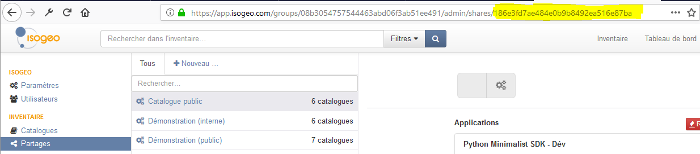

# Ségrégation de résultats par partage

> Paramètre : s

### Description

Par défaut les routes de l’API concernent toutes les entités qui sont accessibles aux applications :
* les entités accessibles à l’utilisateur dans le cas d’une [application utilisateur](/authentication/usersapps.md).
* les entités partagées à l’application dans le cas d’une [application de groupe](/authentication/groupsapps.md).

Les applications tierces d'Isogeo accèdent aux catalogues de métadonnées que les administrateurs choisissent de leur partager via le menu "Partages" de l'interface d'administration ([voir documentation fonctionnelle](http://help.isogeo.com/fr/features/admin/shares.html)).

C'est lié au fait que :

* plusieurs groupes de travail peuvent partager des catalogues à une même application
* un groupe de travail peut créer plusieurs partages alimentant la même application (même si ce n'est pas recommandé aux administrateurs).

Par exemple, si un administrateur 1 du  GT (workgroup) A crée 2 partages différents à l'application PLUGIN et qu'un administrateur 2 du GT B crée 1 partage à la même application PLUGIN, alors la recherche s’effectuera sur l’ensemble des fiches contenues dans les 3 partages.

Ce paramètre permet à une application de proposer à l'utilisateur final de filtrer sur tel ou tel partage.

### Valeurs possibles

Le paramètre accepte l'identifiant d'un partage, c'est-à-dire une chaîne de 32 caractères alphanumériques, généré à la création du partage via l'interface d'administration d'Isogeo \(https://app.isogeo.com/admin/shares/{sid}) :



Pour récupérer les informations d'un partage ou plusieurs partages, consulter [la section dédiée](/shares.md).


### Exemples

URL de recherche filtrée sur un partage :

```
https://v1.api.isogeo.com/resources/search?s=c502e8f7c9da4c3aacdf3d905672d54c
```

L'application OpenCatalog fonctionne ainsi.


